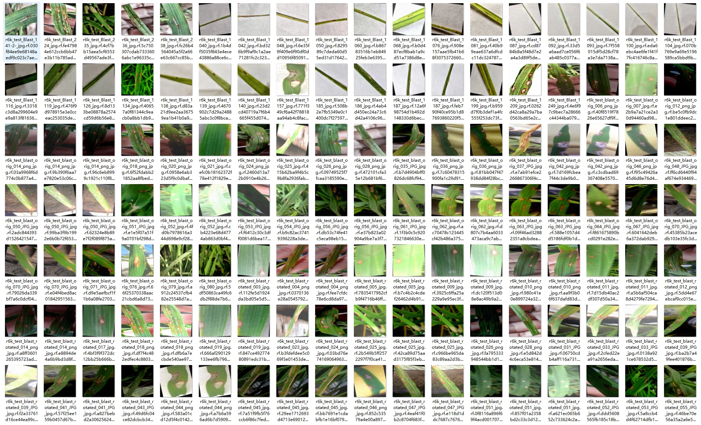
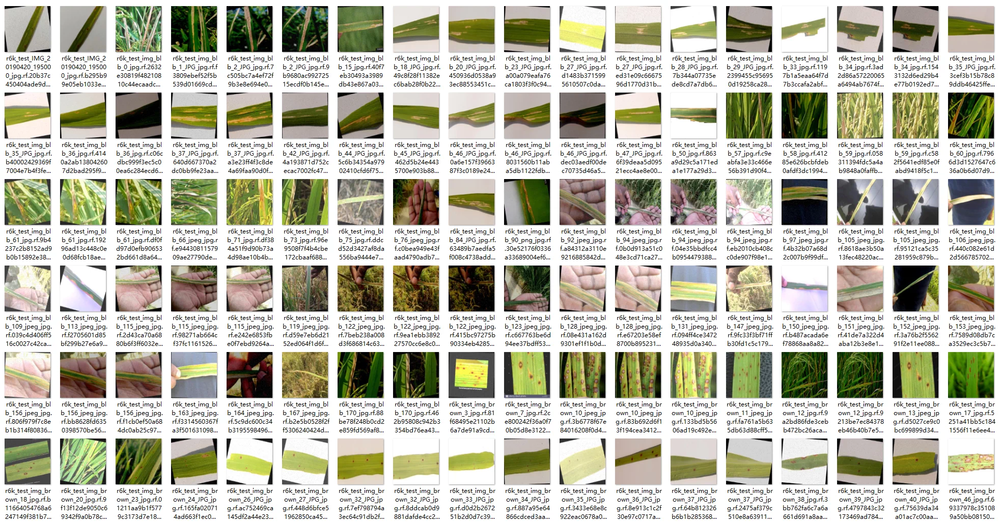
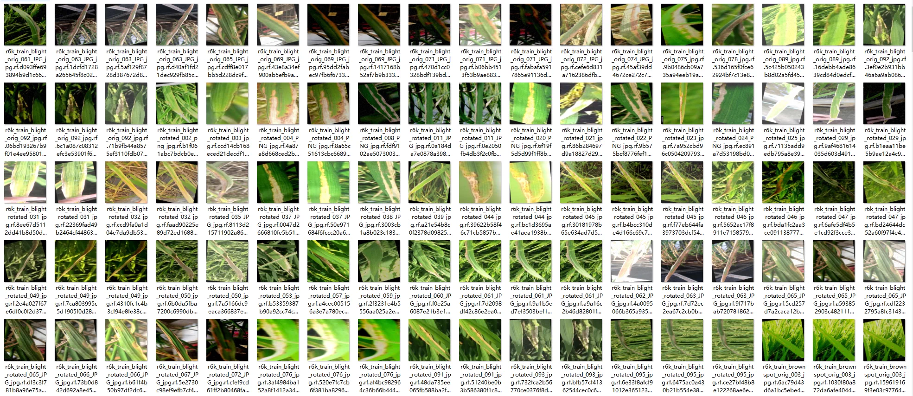
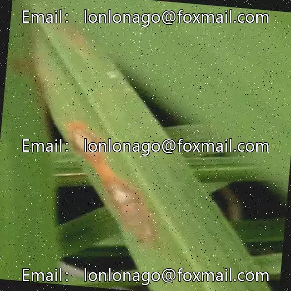
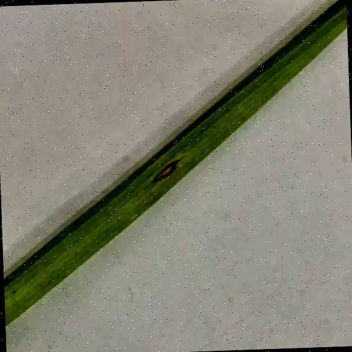
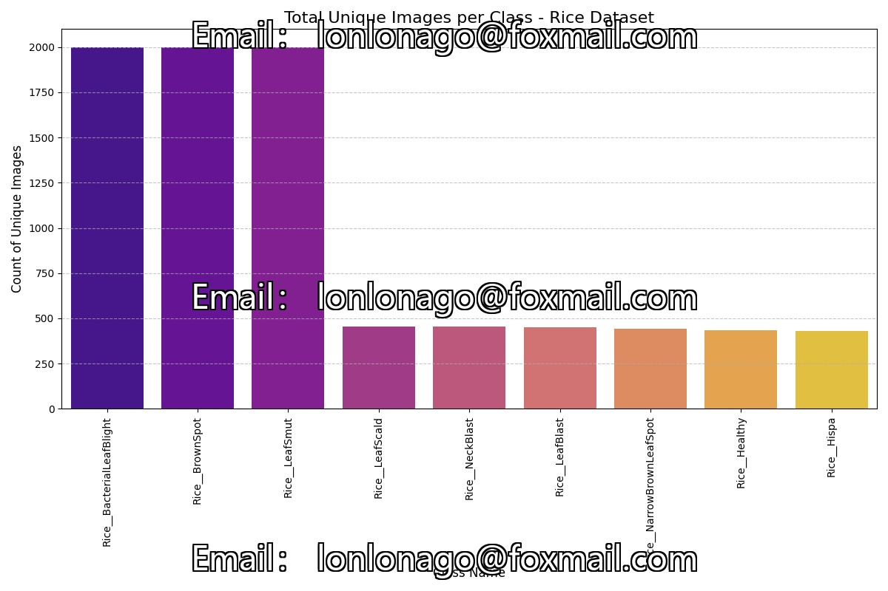
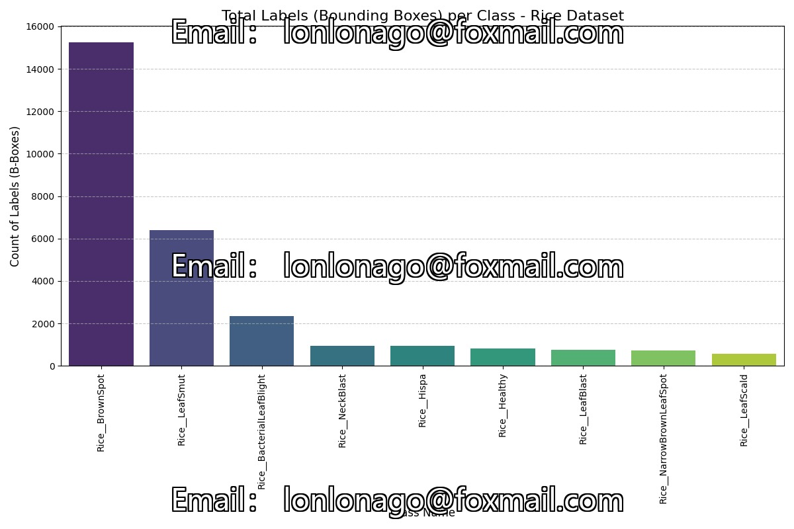

## Body

（Agricultural Products）Rice Leaf Disease Target Detection Dataset in YOLO format

This dataset provides a comprehensive and high-quality collection of rice leaf images specifically tailored for object detection tasks in precision agriculture. It covers 9 different categories, encompassing healthy rice leaves as well as eight common diseases, such as brown spot disease, blast disease, and bacterial leaf blight.

The dataset is fully preprocessed and structured in the standard YOLO format, making it ready to use immediately for training state-of-the-art computer vision models (such as YOLOv8 and YOLOv11) without the need for manual data organization or format conversion.

Totaling 8665 images, each labeled and divided into training sets and validation sets.
It is divided into 9 categories, namely:

- Rice__BacterialLeafBlight 稻米__细菌性叶枯病
- Rice__BrownSpot 稻米__褐斑病
- Rice__Healthy 稻米__健康型
- Rice__Hispa 稻米__希帕型
- Rice__LeafBlast 稻米__叶枯病
- Rice__LeafScald 稻米__叶灼伤
- Rice__LeafSmut 稻米__叶锈病
- Rice__NarrowBrownLeafSpot 稻米__窄褐斑病
- Rice__NeckBlast 稻米__颈部枯病

## Images

item_1048733996077

Here is a pay link on Stripe ( https://buy.stripe.com/3cs8yP7sY87d0vu9AB ). Please contact me lonlonago@foxmail.com after funding $89, and I will send you a complete data files , thank you!

